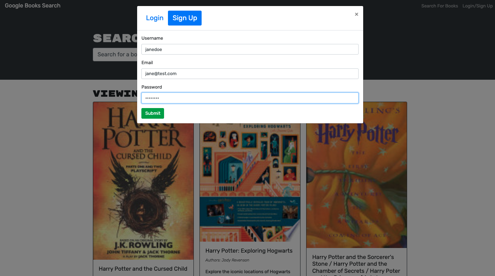

## Book Search Engine
## Heroku Deployment

[Heroku deployment link](https://warm-bayou-86801.herokuapp.com/)

## License 


## Description 

This is a search engine utilizing google API,MongoDB, GraphQL and Apollo. You can search for books and login/logout as a user.





## Table of Contents 

[Installation](#Installation)


[Usage](#Usage)


[License](#License)


[Questions](#Questions)


## Installtion

The application requires GraphQl and Apollo Server. To install this application you will clone the repo to your local machine. 


## Usage 

To run the application on your local machine run the following commands: 

Install application: ``` npm install ```

Run application: ```npm run develop```


## License 

MIT License 

## Questions 

Alex Olsavsky

Email: [alexandraolsavsky@gmail.com](alexandraolsavsky@gmail.com)


GitHub: [Here is the link to my github page](https://github.com/ajolsavsky)